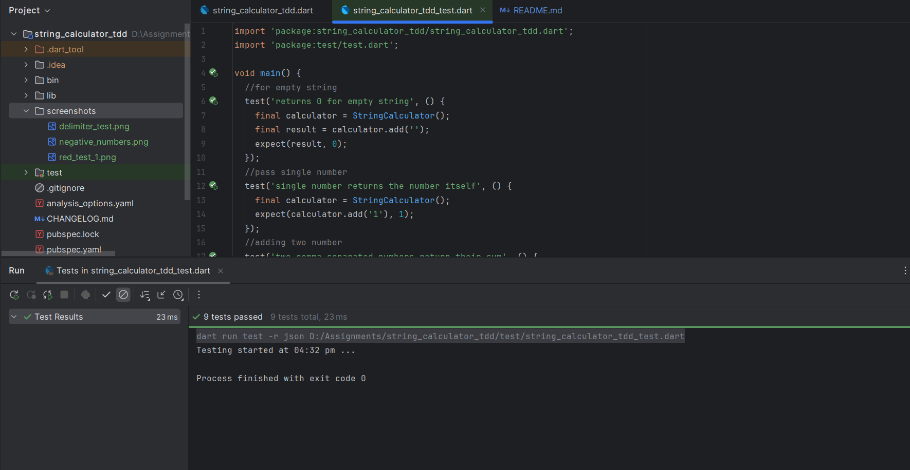

# String Calculator — Incubyte TDD Assessment

This repository contains my implementation of the **String Calculator Kata**, developed using **strict Test-Driven Development (TDD)** in accordance with Incubyte’s software craftsmanship standards.

The primary goal was not just to make the code work, but to demonstrate:

* Incremental design
* RED → GREEN → REFACTOR cycles
* Clean, testable code
* Honest, auditable commit history

---

## 🧪 TDD Methodology Used

This project was built using **true TDD**.

Every feature was implemented following this cycle:

```
1. RED      Write a failing test
2. GREEN    Write the minimum code to pass the test
3. REFACTOR Improve the code while keeping tests green
```

This process is visible directly in the **Git commit history**, where each feature is represented by:

* `test:` commit (RED)
* `feat:` / `fix:` commit (GREEN)
* `refactor:` commit (REFACTOR)

The commit history intentionally contains many small commits to show how the solution evolved step-by-step.

---

## 🧩 Problem Statement

Implement a String Calculator with the following signature:

```dart
class StringCalculator {
  int add(String numbers);
}
```

### Rules

| Input        | Output |
| ------------ | ------ |
| `""`         | `0`    |
| `"1"`        | `1`    |
| `"1,5"`      | `6`    |
| `"1\n2,3"`   | `6`    |
| `"//;\n1;2"` | `3`    |

Additional rules:

* Allow any number of numbers
* Newlines act as delimiters
* Support custom delimiters (`//;\n`)
* Support multi-character delimiters (`//[***]\n`)
* Support multiple delimiters (`//[*][%]\n`)
* Negative numbers throw an exception listing all negatives
* Numbers greater than 1000 are ignored

---

## ✅ Feature Checklist

| Feature                   | Example                | Test |
| ------------------------- | ---------------------- | ---- |
| Empty string returns 0    | `""`                   | ✅    |
| Single number             | `"1"`                  | ✅    |
| Two numbers               | `"1,5"`                | ✅    |
| Multiple numbers          | `"1,2,3"`              | ✅    |
| Newline delimiter         | `"1\n2,3"`             | ✅    |
| Custom delimiter          | `"//;\n1;2"`           | ✅    |
| Multi-character delimiter | `"//[***]\n1***2***3"` | ✅    |
| Multiple delimiters       | `"//[*][%]\n1*2%3"`    | ✅    |
| Negative numbers throw    | `"1,-2"`               | ✅    |
| Multiple negatives        | `"1,-2,-3"`            | ✅    |
| Ignore >1000              | `"2,1001"`             | ✅    |

Each behavior is covered by **independent tests** in
`test/string_calculator_tdd_test.dart`.

---

## 📸 Test Evidence (Screenshots)

Add screenshots in a `screenshots/` folder.

Example:

```
screenshots/
├── red_first_test.png
├── delimiter_test.png
├── negative_numbers.png
├── final_all_tests_green.png
```

Then include them like this:

```md

```

This proves tests were run and supports the TDD claim.

---

## 🧠 Code Design

The final design uses small, focused methods:

* Delimiter parsing
* Number extraction
* Validation
* Filtering (>1000)
* Summation

This structure emerged **only after repeated refactoring while tests stayed green**.

---

## ▶ How to Run

```bash
dart pub get
dart test
```

---

## 🧾 Why This Meets Incubyte’s Standards

* ✔ Strict TDD followed
* ✔ RED → GREEN → REFACTOR visible in commits
* ✔ Independent tests
* ✔ Edge cases covered
* ✔ Clean final design
* ✔ Honest commit history

---

## 📌 Repository

[https://github.com/tushshah4442/string-calculator-tdd](https://github.com/tushshah4442/string-calculator-tdd)

---
